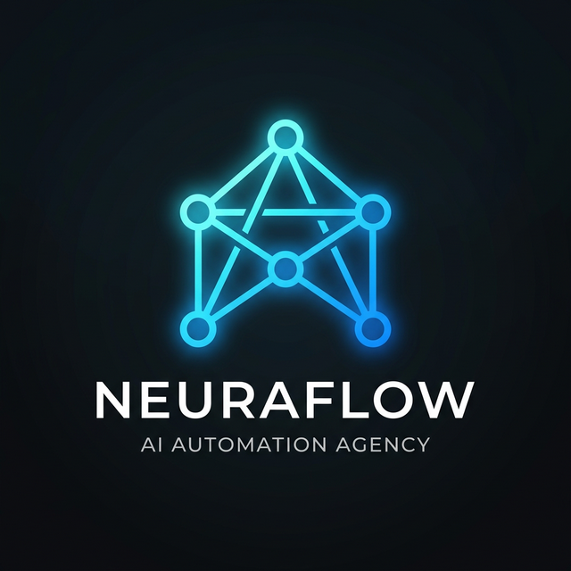

<div align="center">


#  Nexus — AI Agency Blueprint
**Your Complete toolkit to build, sell, and scale AI-Powered Workflows, Voice Agents & Autonomous Solutions**

[](https://git.io/typing-svg)

[](#) [](#) [](#)

</div>

<br />

## 📋 Quick Navigation

| Section | Description |
| :--- | :--- |
| **[🎯 Problem & Solution](#-the-problem-we-solve)** | Why every business needs AI right now |
| **[✨ Products & Services](#-products--services-you-can-sell)** | What AI systems you will build & sell |
| **[🏗️ Architecture](#-system-architecture)** | How AI agents are structured |
| **[👥 Target Clients](#-target-clients--niches)** | Who buys these solutions |
| **[🛠️ Tech Stack](#-tech-stack)** | Technologies used (Code & No-code) |
| **[🚀 Getting Started](#-getting-started)** | Run your agency locally or deploy |
| **[📚 Knowledge Hub](#-knowledge-hub--playbooks)** | Learning resources, sales scripts & guides |
| **[🗄️ Automation Workflows](#-automation-workflows)** | Pre-built agent logic and integrations |
| **[🔒 Security](#-security--privacy)** | How we protect client data |
| **[📊 ROI & Case Studies](#-roi--impact)** | Measurable business impact to pitch |
| **[🗺️ Roadmap](#️-agency-roadmap)** | What's coming next |

---

## 🎯 The Problem We Solve

```text
┌─────────────────────────────────────────────────────────────────┐
│                    🏢 A MODERN BUSINESS'S DAILY STRUGGLES        │
├─────────────────────────────────────────────────────────────────┤
│                                                                 │
│   ❌ Missed late-night calls  →  Lost revenue & leads           │
│   ❌ Repetitive manual tasks  →  Wasting 20+ hours a week       │
│   ❌ Slow customer support    →  Low customer satisfaction      │
│   ❌ Scattered data & tools   →  Messy internal operations      │
│   ❌ Expensive payroll        →  Paying human agents $15+/hr    │
│   ❌ Complicated coding       →  Automation seems out of reach  │
│                                                                 │
└─────────────────────────────────────────────────────────────────┘
                              ⬇️
┌─────────────────────────────────────────────────────────────────┐
│                    ✅ YOUR AI AGENCY SOLVES IT ALL               │
├─────────────────────────────────────────────────────────────────┤
│                                                                 │
│   📞 AI Voice Agents          →  Answers calls 24/7, books appts│
│   🤖 Autonomous Chatbots     →  Instant support & lead capture │
│   ⚡ No-Code Workflows        →  Syncs CRM, emails, and data    │
│   💬 WhatsApp/SMS Bots       →  Follow-up with leads instantly │
│   🌐 Custom AI Agents         →  Does research or specific tasks│
│   💰 High ROI for Clients     →  Fraction of a human salary     │
│                                                                 │
└─────────────────────────────────────────────────────────────────┘
```

---

## ✨ Products & Services You Can Sell

### 📞 AI Voice Operations (Voice Agents)
| Feature | Description | Price to Charge |
| :--- | :--- | :--- |
| **🎙️ Inbound Call Answering** | Lifelike AI voices answer support queries and book calendar slots seamlessly. | $500 - $1,500 setup + $100/mo |
| **☎️ Outbound Sales Calling** | Voice agents that qualify leads, pitch, and sync outcomes back to the CRM. | $1,000 - $3,000 setup + usage |
| **🌍 Multi-lingual Dispatch** | Communicate with local and international clients in 30+ spoken languages. | Premium Add-on |

### ⚡ Seamless Automations (No-Code & Code)
| Feature | Description | Price to Charge |
| :--- | :--- | :--- |
| **🔗 CRM Integrations** | Webhooks that auto-update HubSpot/Salesforce when a lead takes action. | $300 - $800 / workflow |
| **📧 Cold Outreach Flows** | Multi-step personalized email sequences driven by LLMs. | $1,500/mo retainer |
| **📊 Smart Data Extraction** | AI analyzing unstructured data from invoices, PDFs, or emails. | $500 setup + $200/mo |

### 🤖 Custom AI Agents
| Feature | Description | Price to Charge |
| :--- | :--- | :--- |
| **💬 Smart Chatbots** | Website widgets trained on company docs to handle inquiries 24/7. | $500 setup + $99/mo |
| **📝 Content Copilots** | AI agents that generate SEO blogs, social media posts, and newsletters. | $500/mo retainer |
| **🔬 Research Agents** | Scrapes the web and summarizes competitor pricing or market trends. | $800 custom build |

---

## 👨‍💼 Target Clients & Niches

| Niche | Pain Point | Custom Agency Solution |
| :--- | :--- | :--- |
| **Real Estate** | Missing calls from buyers out in the field | **Voice Agent** that screens buyers & books viewings |
| **E-Commerce** | "Where is my order?" questions overwhelming support | **Chatbot Agent** integrated with Shopify order status |
| **Healthcare/Dental** | Front-desk overwhelmed with appointments | **Appointment Setter Voice Bot** using HIPAA-compliant flows |
| **Marketing Agencies** | Manual lead crunching and qualification | **N8n/Make Workflows** to scrape, enrich, and email leads |

---

## 🛠️ Tech Stack & Supported Platforms

### ⚡ Automation & No-Code
 
 
 

### 📞 Voice & Conversational AI
 
 
 
 
 
 
 

### 🧠 Top 10 Commercial (Paid) LLMs


### 🌍 Top 10 Open Source (Free) LLMs


### 🏗️ Infrastructure & Custom Code
 
 
 

---

## 🚀 Getting Started

⚡ **Quick Start (2 minutes)**

```bash
# Clone the repository
git clone https://github.com/your-username/ai-agency-blueprint.git

# Navigate to project
cd ai-agency-blueprint

# Install dependencies for custom webhook handlers
npm install

# Setup your environment variables (API Keys for OpenAI, Vapi, Make, etc.)
cp .env.example .env

# Start the local development server
npm run dev
```

🎉 **Open `http://localhost:3000` in your browser to view your Agency Dashboard!**

---

## 📚 Knowledge Hub & Playbooks
🎓 **Your Agency Learning Center — Sales Scripts, Proposals, and Templates**

| Content Type | Description | Location |
| :--- | :--- | :--- |
| **🎧 Voice Scripts** | Battle-tested system prompts for AI Voice agents | `/playbooks/voice/prompts.md` |
| **🖼️ Automation Blueprints**| Downloadable JSON blueprints for Make.com / n8n | `/workflows/blueprints/` |
| **📄 Sales Pitch Decks** | Slide templates to sell APIs and Automations to clients | `/docs/sales-decks/` |
| **📜 Client Contracts** | Legal templates for SaaS and Automation retainers | `/docs/legal/` |

---

## 🗄️ Automation Workflows

We provide pre-built workflows that you can instantly import into Make.com or n8n:

1. **Lead Qualification Flow**: Webhook ➡️ OpenAI (Extract Data) ➡️ CRM Update ➡️ Slack Notification
2. **AI Voice Calender Booking**: Vapi AI Call ➡️ Function Call ➡️ Google Calendar API ➡️ Confirmation SMS
3. **Automated Invoice Processing**: Email Parsing ➡️ OCR & LLM Extraction ➡️ QuickBooks/Xero Sync

---

## 🔒 Security & Privacy

When selling to enterprise or healthcare clients, security is your best selling point:

| Layer | Implementation |
| :--- | :--- |
| **🔐 PI/PHI Scrubbing** | Using local regex layers before sending text to public LLMs (Crucial for HIPAA). |
| **🛡️ Token Limits** | Built-in cost-control to prevent AI hallucinations from draining your API credits. |
| **🔑 API Key Security** | Secure Vault / Environment Variables — never hardcoded in client deliverables. |
| **✅ Input Guardrails** | Strict system prompts and prompt-injection safety layers for Chatbots. |

---

## 📊 ROI & Impact (What you pitch to clients)

📚 **Use these statistics in your sales calls:**

| Solution Deployed | Client Type | Business Impact |
| :--- | :--- | :--- |
| **Inbound Voice Bot** | Real Estate Broker | Missed 0 calls; 14% increase in house-viewing bookings. |
| **Automated Lead Gen** | Marketing Agency | Saved 25 hours/week; decreased lead response time to < 1 minute. |
| **AI Support Chat** | E-commerce Store | Deflected 65% of repetitive support tickets instantly. |

---

## 🗺️ Roadmap

| Status | Feature |
| :---: | :--- |
| ✅ | Standard Make.com / Zapier webhook templates |
| ✅ | OpenAI Assistants API integration blueprints |
| ✅ | Basic Voice Agent prototype (Vapi & ElevenLabs) |
| ✅ | Sales & Pricing Calculator Dashboard |
| 🔜 | Multi-agent framework (Autogen / CrewAI templates) |
| 🔜 | WhatsApp Business API automation flows |
| 🔜 | Automated Cold Email Outbound Infrastructure |
| 🔜 | White-label client portal |


---

## ⭐ Support This Project

No money needed! Just give us a ⭐ star — it helps other entrepreneurs discover this free agency toolkit!

**Why star?**
🔍 Helps other founders & developers find this project
📈 Shows the community believes in decentralized AI business
💚 Motivates continued development — 100% free forever

### 🤝 Contributing
We welcome contributions! Built a cooler workflow? Found a better voice prompt?
1. 🍴 Fork the repository
2. 🌿 Create feature branch (`git checkout -b feature/amazing-workflow`)
3. 💾 Commit changes (`git commit -m 'Add HubSpot Sync Workflow'`)
4. 📤 Push to branch (`git push origin feature/amazing-workflow`)
5. 🔄 Open Pull Request

---

## 📄 License
© 2026 Nexus AI Agency Toolkit. All Rights Reserved.

This project is created to empower developers to build profitable businesses using AI and Automations.

<p align="center">
<b>Made with ❤️ for AI Builders & Entrepreneurs 🚀🤖</b>
</p>
